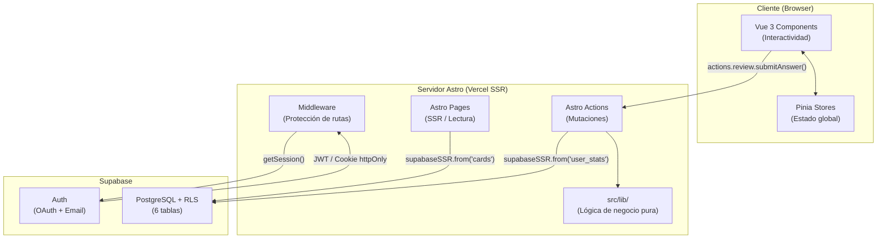
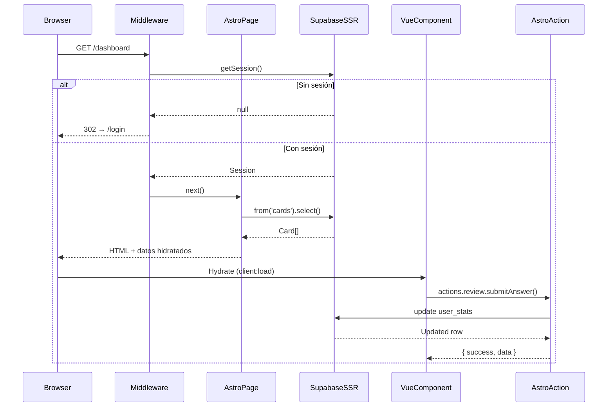
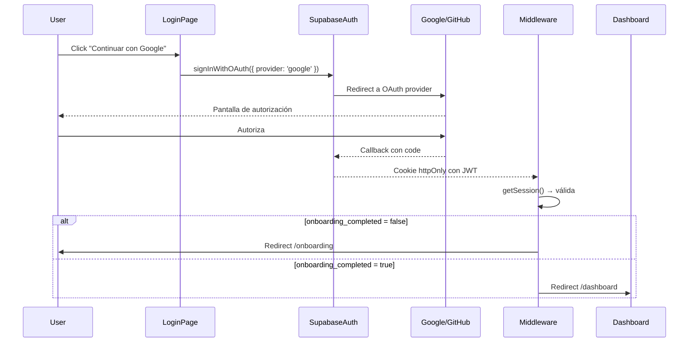
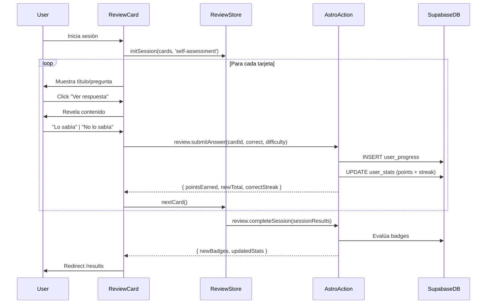
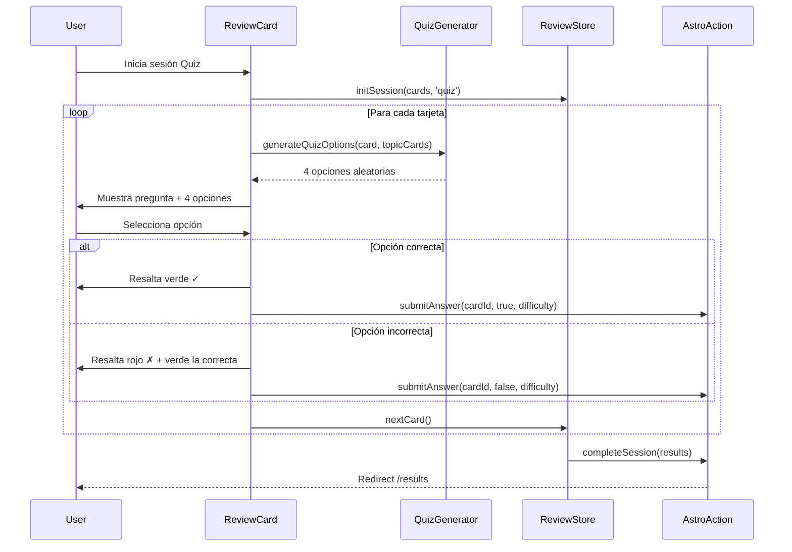
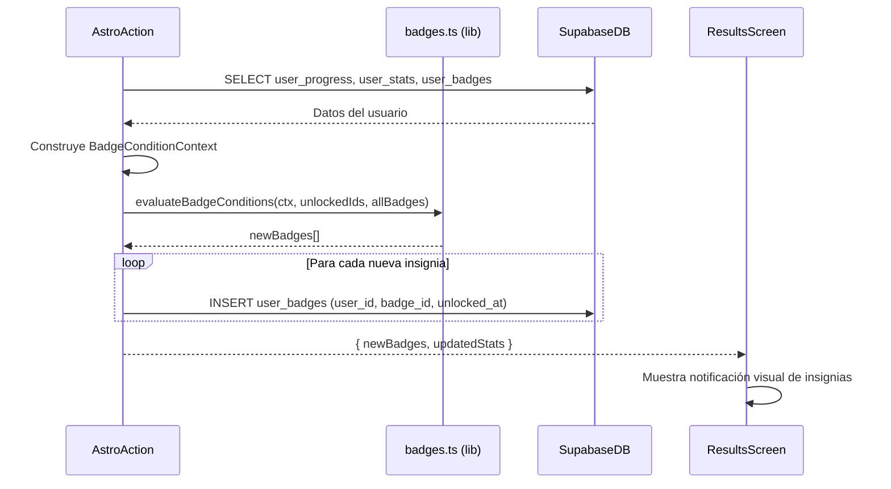

# Design Document — MicroLearn Platform

## Overview

MicroLearn es una plataforma de microaprendizaje gamificada para el estudio personal de JavaScript y TypeScript. Combina tarjetas de estudio, dos modos de repaso (Self-Assessment y Quiz), un motor de puntos con bonificaciones por racha, seguimiento de racha diaria y un sistema de 9 insignias.

**Stack tecnológico:**
- **Frontend/SSR:** Astro 5 con adaptador Vercel
- **UI interactiva:** Vue 3 + Composition API (`<script setup>`) + Pinia
- **Estilos:** TailwindCSS v4 (solo `@theme` en CSS, sin `tailwind.config.js`)
- **Backend/Auth/DB:** Supabase (Auth + PostgreSQL con RLS)
- **Testing:** Vitest + fast-check (PBT) + Playwright (E2E)
- **Package manager:** pnpm (exclusivo)
- **Deploy:** Vercel

---

## Architecture

### Diagrama de capas



### Flujo de request/response con SSR



### Separación de responsabilidades

| Capa | Responsabilidad | Acceso a Supabase |
|------|----------------|-------------------|
| **Astro Pages** | SSR, lectura de datos públicos, renderizado inicial | Solo lectura (cards, badges) |
| **Vue Components** | Interactividad, UI, invocar Actions | Nunca directo |
| **Astro Actions** | Todas las mutaciones, validación de sesión server-side | Lectura + escritura (datos de usuario) |
| **src/lib/** | Lógica de negocio pura (puntos, rachas, insignias) | Sin acceso (funciones puras) |
| **Middleware** | Protección de rutas, verificación de sesión | Solo `getSession()` |

---

## Components and Interfaces

### Estructura de carpetas completa

```
/src
  /actions
    index.ts              ← Todas las Astro Actions
  /components
    /ui
      GlassCard.vue       ← Contenedor glassmorphism base
      GlassButton.vue     ← Botón con estilo glass
      GlassBadge.vue      ← Badge/chip visual
      ToasterWrapper.vue  ← Wrapper del Toaster de vue-sonner (montado en AppLayout)
    /layout
      Header.vue          ← Header con logo y ThemeToggle
      Sidebar.vue         ← Navegación lateral (≥768px)
      BottomNav.vue       ← Navegación inferior (<768px)
      ThemeToggle.vue     ← Switch claro/oscuro
    /auth
      LoginForm.vue       ← Formulario email+pass + OAuth
      RegisterForm.vue    ← Formulario de registro
    /cards
      CardItem.vue        ← Tarjeta individual en Library
      CardLibrary.vue     ← Grid de tarjetas con filtros
      ReviewCard.vue      ← Tarjeta en sesión de repaso
      ReviewResults.vue   ← Pantalla de resultados
    /badges
      BadgeItem.vue       ← Insignia individual (locked/unlocked)
      BadgeGrid.vue       ← Grid de insignias agrupadas
    /onboarding
      OnboardingForm.vue  ← Selección de topics inicial
    /profile
      ProfileView.vue     ← Stats + edición de topics
  /composables
    useReviewSession.ts   ← Lógica de sesión de repaso
    useTheme.ts           ← Gestión de tema claro/oscuro
  /layouts
    BaseLayout.astro      ← HTML base, meta, estilos globales
    AppLayout.astro       ← Layout con nav (sidebar/bottom)
  /lib
    errors.ts             ← Módulo centralizado de errores (AppError, logServerError, mapSupabaseError)
    points.ts             ← Cálculo de puntos (puro)
    streak.ts             ← Lógica de racha diaria (puro)
    badges.ts             ← Evaluación de insignias (puro)
    supabase.ts           ← Clientes Supabase (browser + SSR)
    theme.ts              ← Utilidades de tema
  /middleware
    index.ts              ← Protección de rutas Astro
  /pages
    index.astro           ← Redirect → /dashboard o /login
    login.astro           ← Página de login
    register.astro        ← Página de registro
    onboarding.astro      ← Flujo de onboarding
    dashboard.astro       ← Dashboard principal
    library.astro         ← Biblioteca de tarjetas
    review/
      index.astro         ← Inicio de sesión (selección de modo)
      [mode].astro        ← Sesión activa (self-assessment | quiz)
    results.astro         ← Pantalla de resultados
    badges.astro          ← Pantalla de insignias
    profile.astro         ← Perfil y estadísticas
  /stores
    auth.ts               ← useAuthStore
    user.ts               ← useUserStore
    review.ts             ← useReviewStore
  /styles
    global.css            ← TailwindCSS v4 @theme + variables CSS
  /types
    database.ts           ← Tipos que mapean tablas Supabase
    app.ts                ← Tipos de dominio de la aplicación
/tests
  /unit
    points.test.ts        ← PBT + unit tests para points.ts
    streak.test.ts        ← PBT + unit tests para streak.ts
    badges.test.ts        ← PBT + unit tests para badges.ts
    quiz.test.ts          ← PBT + unit tests para Quiz_Generator
  /e2e
    auth.spec.ts          ← Login, registro, OAuth
    review.spec.ts        ← Sesión completa self-assessment + quiz
    badges.spec.ts        ← Desbloqueo de insignias
```

### Astro Actions — Firmas TypeScript

```typescript
// src/actions/index.ts
import { defineAction } from 'astro:actions'
import { z } from 'astro:schema'

export const server = {
  review: {
    // Registra una respuesta y actualiza puntos + racha
    submitAnswer: defineAction({
      input: z.object({
        cardId: z.string().uuid(),
        correct: z.boolean(),
        difficulty: z.enum(['easy', 'medium', 'hard']),
      }),
      handler: async (input, context): Promise<SubmitAnswerResult> => { /* ... */ }
    }),

    // Finaliza la sesión: evalúa badges + actualiza stats
    completeSession: defineAction({
      input: z.object({
        sessionResults: z.array(z.object({
          cardId: z.string().uuid(),
          correct: z.boolean(),
          difficulty: z.enum(['easy', 'medium', 'hard']),
          pointsEarned: z.number().int().nonnegative(),
        })),
      }),
      handler: async (input, context): Promise<CompleteSessionResult> => { /* ... */ }
    }),
  },

  onboarding: {
    // Guarda topics seleccionados + crea user_stats inicial
    savePreferences: defineAction({
      input: z.object({
        topics: z.array(z.string().min(1)).min(1),
      }),
      handler: async (input, context): Promise<void> => { /* ... */ }
    }),
  },

  profile: {
    // Actualiza los topics seleccionados del usuario
    updateTopics: defineAction({
      input: z.object({
        topics: z.array(z.string().min(1)).min(1),
      }),
      handler: async (input, context): Promise<void> => { /* ... */ }
    }),
  },
}
```

### Pinia Stores

```typescript
// src/stores/auth.ts
export const useAuthStore = defineStore('auth', () => {
  const user = ref<User | null>(null)
  const session = ref<Session | null>(null)

  function setUser(newUser: User, newSession: Session) { /* ... */ }
  function clearUser() { /* ... */ }

  return { user, session, setUser, clearUser }
})

// src/stores/user.ts
export const useUserStore = defineStore('user', () => {
  const stats = ref<UserStats | null>(null)
  const preferences = ref<UserPreferences | null>(null)
  const badges = ref<UserBadge[]>([])

  async function loadUserData(userId: string) { /* ... */ }
  function updateStats(partial: Partial<UserStats>) { /* ... */ }
  function addBadge(badge: UserBadge) { /* ... */ }

  return { stats, preferences, badges, loadUserData, updateStats, addBadge }
})

// src/stores/review.ts
export const useReviewStore = defineStore('review', () => {
  const deck = ref<Card[]>([])
  const currentIndex = ref(0)
  const mode = ref<'self-assessment' | 'quiz'>('self-assessment')
  const sessionResults = ref<SessionResult[]>([])
  const correctStreak = ref(0)

  function initSession(cards: Card[], reviewMode: 'self-assessment' | 'quiz') { /* ... */ }
  async function submitAnswer(cardId: string, correct: boolean, difficulty: Difficulty) { /* ... */ }
  function nextCard() { /* ... */ }
  async function completeSession() { /* ... */ }

  const currentCard = computed(() => deck.value[currentIndex.value] ?? null)
  const progress = computed(() => ({ current: currentIndex.value + 1, total: deck.value.length }))

  return { deck, currentIndex, mode, sessionResults, correctStreak, currentCard, progress,
           initSession, submitAnswer, nextCard, completeSession }
})
```

### Composables

```typescript
// src/composables/useReviewSession.ts
export function useReviewSession() {
  const store = useReviewStore()
  // Encapsula la lógica de UI de la sesión: flip de tarjeta, animaciones, etc.
  const isFlipped = ref(false)
  function flipCard() { isFlipped.value = true }
  function handleAnswer(correct: boolean) {
    store.submitAnswer(store.currentCard!.id, correct, store.currentCard!.difficulty)
    isFlipped.value = false
  }
  return { isFlipped, flipCard, handleAnswer }
}

// src/composables/useTheme.ts
export function useTheme() {
  const theme = ref<'light' | 'dark'>(
    (localStorage.getItem('theme') as 'light' | 'dark') ?? 'light'
  )
  function toggle() {
    theme.value = theme.value === 'light' ? 'dark' : 'light'
    document.documentElement.setAttribute('data-theme', theme.value)
    localStorage.setItem('theme', theme.value)
  }
  return { theme, toggle }
}
```

### Notificaciones con Sonner

**Instalación:**

```bash
pnpm add vue-sonner
```

El componente `<Toaster />` se monta una sola vez en `AppLayout.astro` a través del wrapper Vue `ToasterWrapper.vue`, que se hidrata con `client:load`. Desde cualquier componente Vue o composable se importa el helper `toast` de `vue-sonner` para disparar notificaciones.

**Integración en AppLayout:**

```astro
<!-- src/layouts/AppLayout.astro -->
<!-- Montar el Toaster una sola vez en el layout principal -->
<ToasterWrapper client:load />
```

**Wrapper Vue:**

```vue
<!-- src/components/ui/ToasterWrapper.vue -->
<script setup lang="ts">
import { Toaster } from 'vue-sonner'
import { useTheme } from '@/composables/useTheme'

const { theme } = useTheme()
</script>
<template>
  <Toaster position="bottom-right" :theme="theme" rich-colors />
</template>
```

El tema del Toaster se sincroniza automáticamente con el tema claro/oscuro de la app a través del composable `useTheme`, de modo que los toasts respetan el `data-theme` activo.

**Casos de uso en la plataforma:**

| Evento | Llamada |
|--------|---------|
| Respuesta correcta | `toast.success('¡+10 puntos!')` |
| Badge desbloqueado | `toast.success('🏆 ¡Nueva insignia desbloqueada! Primer paso')` |
| Error de autorización | `toast.error('No tienes permiso para acceder a este recurso')` |
| Bonus de racha alcanzado | `toast.info('¡Racha de 3! +5 puntos bonus')` |
| Error al guardar progreso | `toast.error('Error al guardar el progreso. Inténtalo de nuevo.')` |

---

## Data Models

### Esquema de base de datos (DDL SQL)

```sql
-- ============================================================
-- TABLA: cards (contenido público, sin RLS restrictivo)
-- ============================================================
CREATE TABLE cards (
  id          UUID PRIMARY KEY DEFAULT gen_random_uuid(),
  title       TEXT NOT NULL,
  content     TEXT NOT NULL,
  topic       TEXT NOT NULL,           -- texto libre, extensible
  subtopic    TEXT NOT NULL DEFAULT '',
  difficulty  TEXT NOT NULL CHECK (difficulty IN ('easy', 'medium', 'hard')),
  points      INTEGER NOT NULL DEFAULT 10,
  created_at  TIMESTAMPTZ NOT NULL DEFAULT now()
);

CREATE INDEX idx_cards_topic ON cards (topic);
CREATE INDEX idx_cards_difficulty ON cards (difficulty);
CREATE INDEX idx_cards_topic_subtopic ON cards (topic, subtopic);

-- Lectura pública para todos los usuarios autenticados
ALTER TABLE cards ENABLE ROW LEVEL SECURITY;
CREATE POLICY "cards_read_authenticated"
  ON cards FOR SELECT
  TO authenticated
  USING (true);

-- ============================================================
-- TABLA: badges (contenido público, sin RLS restrictivo)
-- ============================================================
CREATE TABLE badges (
  id          UUID PRIMARY KEY DEFAULT gen_random_uuid(),
  name        TEXT NOT NULL UNIQUE,
  description TEXT NOT NULL,
  icon        TEXT NOT NULL,           -- emoji o nombre de icono
  level       TEXT NOT NULL CHECK (level IN ('basic', 'intermediate', 'advanced')),
  condition   JSONB NOT NULL           -- condición serializada para Badge_Engine
);

ALTER TABLE badges ENABLE ROW LEVEL SECURITY;
CREATE POLICY "badges_read_authenticated"
  ON badges FOR SELECT
  TO authenticated
  USING (true);

-- ============================================================
-- TABLA: user_progress (RLS por usuario)
-- ============================================================
CREATE TABLE user_progress (
  id          UUID PRIMARY KEY DEFAULT gen_random_uuid(),
  user_id     UUID NOT NULL REFERENCES auth.users(id) ON DELETE CASCADE,
  card_id     UUID NOT NULL REFERENCES cards(id) ON DELETE CASCADE,
  correct     BOOLEAN NOT NULL,
  reviewed_at TIMESTAMPTZ NOT NULL DEFAULT now()
);

CREATE INDEX idx_user_progress_user_id ON user_progress (user_id);
CREATE INDEX idx_user_progress_user_card ON user_progress (user_id, card_id);
CREATE INDEX idx_user_progress_reviewed_at ON user_progress (user_id, reviewed_at);

ALTER TABLE user_progress ENABLE ROW LEVEL SECURITY;
CREATE POLICY "user_progress_own"
  ON user_progress FOR ALL
  TO authenticated
  USING (auth.uid() = user_id)
  WITH CHECK (auth.uid() = user_id);

-- ============================================================
-- TABLA: user_stats (RLS por usuario, 1 fila por usuario)
-- ============================================================
CREATE TABLE user_stats (
  user_id         UUID PRIMARY KEY REFERENCES auth.users(id) ON DELETE CASCADE,
  total_points    INTEGER NOT NULL DEFAULT 0 CHECK (total_points >= 0),
  current_streak  INTEGER NOT NULL DEFAULT 0 CHECK (current_streak >= 0),
  longest_streak  INTEGER NOT NULL DEFAULT 0 CHECK (longest_streak >= 0),
  last_study_date DATE,
  updated_at      TIMESTAMPTZ NOT NULL DEFAULT now()
);

ALTER TABLE user_stats ENABLE ROW LEVEL SECURITY;
CREATE POLICY "user_stats_own"
  ON user_stats FOR ALL
  TO authenticated
  USING (auth.uid() = user_id)
  WITH CHECK (auth.uid() = user_id);

-- ============================================================
-- TABLA: user_badges (RLS por usuario)
-- ============================================================
CREATE TABLE user_badges (
  id          UUID PRIMARY KEY DEFAULT gen_random_uuid(),
  user_id     UUID NOT NULL REFERENCES auth.users(id) ON DELETE CASCADE,
  badge_id    UUID NOT NULL REFERENCES badges(id) ON DELETE CASCADE,
  unlocked_at TIMESTAMPTZ NOT NULL DEFAULT now(),
  UNIQUE (user_id, badge_id)
);

CREATE INDEX idx_user_badges_user_id ON user_badges (user_id);

ALTER TABLE user_badges ENABLE ROW LEVEL SECURITY;
CREATE POLICY "user_badges_own"
  ON user_badges FOR ALL
  TO authenticated
  USING (auth.uid() = user_id)
  WITH CHECK (auth.uid() = user_id);

-- ============================================================
-- TABLA: user_preferences (RLS por usuario, 1 fila por usuario)
-- ============================================================
CREATE TABLE user_preferences (
  user_id              UUID PRIMARY KEY REFERENCES auth.users(id) ON DELETE CASCADE,
  selected_topics      TEXT[] NOT NULL DEFAULT '{}',
  onboarding_completed BOOLEAN NOT NULL DEFAULT false,
  updated_at           TIMESTAMPTZ NOT NULL DEFAULT now()
);

ALTER TABLE user_preferences ENABLE ROW LEVEL SECURITY;
CREATE POLICY "user_preferences_own"
  ON user_preferences FOR ALL
  TO authenticated
  USING (auth.uid() = user_id)
  WITH CHECK (auth.uid() = user_id);
```

### Tipos TypeScript

```typescript
// src/types/database.ts — mapeo exacto de tablas Supabase

export interface DbCard {
  id: string
  title: string
  content: string
  topic: string
  subtopic: string
  difficulty: 'easy' | 'medium' | 'hard'
  points: number
  created_at: string
}

export interface DbBadge {
  id: string
  name: string
  description: string
  icon: string
  level: 'basic' | 'intermediate' | 'advanced'
  condition: BadgeConditionJson
}

export interface DbUserProgress {
  id: string
  user_id: string
  card_id: string
  correct: boolean
  reviewed_at: string
}

export interface DbUserStats {
  user_id: string
  total_points: number
  current_streak: number
  longest_streak: number
  last_study_date: string | null
  updated_at: string
}

export interface DbUserBadge {
  id: string
  user_id: string
  badge_id: string
  unlocked_at: string
}

export interface DbUserPreferences {
  user_id: string
  selected_topics: string[]
  onboarding_completed: boolean
  updated_at: string
}

// Condición serializada en badges.condition (JSONB)
export type BadgeConditionJson =
  | { type: 'first_correct' }
  | { type: 'correct_streak'; threshold: number }
  | { type: 'total_reviewed'; threshold: number }
  | { type: 'daily_streak'; threshold: number }
  | { type: 'topic_mastery'; topic: string }
  | { type: 'total_correct'; threshold: number }
  | { type: 'perfect_session'; min_cards: number }
  | { type: 'all_cards_mastery' }
```

```typescript
// src/types/app.ts — tipos de dominio de la aplicación

export type Difficulty = 'easy' | 'medium' | 'hard'
export type ReviewMode = 'self-assessment' | 'quiz'
export type BadgeLevel = 'basic' | 'intermediate' | 'advanced'

export interface Card {
  id: string
  title: string
  content: string
  topic: string
  subtopic: string
  difficulty: Difficulty
  points: number
}

export interface Badge {
  id: string
  name: string
  description: string
  icon: string
  level: BadgeLevel
  condition: import('./database').BadgeConditionJson
}

export interface UserBadge {
  badgeId: string
  unlockedAt: string
}

export interface UserStats {
  totalPoints: number
  currentStreak: number
  longestStreak: number
  lastStudyDate: string | null
}

export interface UserPreferences {
  selectedTopics: string[]
  onboardingCompleted: boolean
}

export interface SessionResult {
  cardId: string
  correct: boolean
  difficulty: Difficulty
  pointsEarned: number
}

export interface QuizOption {
  id: string
  title: string
  isCorrect: boolean
}

export interface BadgeConditionContext {
  totalReviewed: number
  correctAnswers: number
  currentStreak: number
  correctStreak: number
  sessionCorrect: number
  sessionTotal: number
  topicProgress: Record<string, { reviewed: number; total: number }>
}

export interface SubmitAnswerResult {
  pointsEarned: number
  newTotal: number
  streakBonus: number
  correctStreak: number
}

export interface CompleteSessionResult {
  newBadges: Badge[]
  updatedStats: UserStats
}
```

### Módulos de lógica de negocio (src/lib/)

```typescript
// src/lib/points.ts

export type Difficulty = 'easy' | 'medium' | 'hard'

export const BASE_POINTS: Record<Difficulty, number> = {
  easy: 10,
  medium: 20,
  hard: 30,
}

/** Puntos base por respuesta. Devuelve 0 si incorrect. */
export function calculatePoints(difficulty: Difficulty, correct: boolean): number {
  if (!correct) return 0
  return BASE_POINTS[difficulty]
}

/**
 * Bonus de racha: +5 al llegar a 3 consecutivas, +15 al llegar a 5.
 * Solo se otorga el bonus en el umbral exacto (no acumulativo por llamada).
 */
export function calculateStreakBonus(correctStreak: number): number {
  if (correctStreak === 5) return 15
  if (correctStreak === 3) return 5
  // Umbrales adicionales cada 3 a partir de 6: 6, 9, 12...
  if (correctStreak > 5 && correctStreak % 3 === 0) return 5
  return 0
}

/** Aplica puntos base + bonus de racha al total actual. */
export function applyPoints(
  current: number,
  difficulty: Difficulty,
  correct: boolean,
  streak: number
): number {
  const base = calculatePoints(difficulty, correct)
  const bonus = correct ? calculateStreakBonus(streak) : 0
  return current + base + bonus
}
```

```typescript
// src/lib/streak.ts

export interface StreakState {
  current_streak: number
  longest_streak: number
  last_study_date: string | null  // formato 'YYYY-MM-DD'
}

/** Determina si la racha se ha roto (más de 1 día de diferencia). */
export function isStreakBroken(lastDate: string | null, today: string): boolean {
  if (!lastDate) return false
  const last = new Date(lastDate)
  const now = new Date(today)
  const diffDays = Math.floor((now.getTime() - last.getTime()) / 86_400_000)
  return diffDays > 1
}

/**
 * Actualiza el estado de racha dado el estado actual y la fecha de hoy.
 * - Mismo día: sin cambios en streak
 * - Día siguiente: incrementa streak
 * - Más de 1 día: reinicia a 1
 * - Sin fecha previa: inicia en 1
 */
export function updateStreak(state: StreakState, today: string): StreakState {
  const { current_streak, longest_streak, last_study_date } = state

  if (last_study_date === today) {
    return state  // ya estudió hoy
  }

  let newStreak: number
  if (!last_study_date || isStreakBroken(last_study_date, today)) {
    newStreak = 1
  } else {
    newStreak = current_streak + 1
  }

  return {
    current_streak: newStreak,
    longest_streak: Math.max(longest_streak, newStreak),
    last_study_date: today,
  }
}
```

```typescript
// src/lib/badges.ts

import type { Badge, BadgeConditionContext } from '../types/app'
import type { BadgeConditionJson } from '../types/database'

/** Evalúa si una condición de insignia se cumple dado el contexto. */
function meetsCondition(condition: BadgeConditionJson, ctx: BadgeConditionContext): boolean {
  switch (condition.type) {
    case 'first_correct':
      return ctx.correctAnswers >= 1
    case 'correct_streak':
      return ctx.correctStreak >= condition.threshold
    case 'total_reviewed':
      return ctx.totalReviewed >= condition.threshold
    case 'daily_streak':
      return ctx.currentStreak >= condition.threshold
    case 'topic_mastery': {
      const tp = ctx.topicProgress[condition.topic]
      return !!tp && tp.reviewed >= tp.total && tp.total > 0
    }
    case 'total_correct':
      return ctx.correctAnswers >= condition.threshold
    case 'perfect_session':
      return ctx.sessionTotal >= condition.min_cards &&
             ctx.sessionCorrect === ctx.sessionTotal
    case 'all_cards_mastery':
      return Object.values(ctx.topicProgress).every(
        tp => tp.reviewed >= tp.total && tp.total > 0
      )
    default:
      return false
  }
}

/**
 * Evalúa todas las insignias y devuelve las recién desbloqueadas.
 * No modifica el estado — es una función pura.
 */
export function evaluateBadgeConditions(
  context: BadgeConditionContext,
  unlockedBadgeIds: string[],
  allBadges: Badge[]
): Badge[] {
  const unlockedSet = new Set(unlockedBadgeIds)
  return allBadges.filter(
    badge => !unlockedSet.has(badge.id) && meetsCondition(badge.condition, context)
  )
}
```

```typescript
// src/lib/supabase.ts

import { createClient } from '@supabase/supabase-js'
import { createServerClient, parseCookieHeader, serializeCookieHeader } from '@supabase/ssr'
import type { AstroCookies } from 'astro'

const supabaseUrl = import.meta.env.PUBLIC_SUPABASE_URL
const supabaseAnonKey = import.meta.env.PUBLIC_SUPABASE_ANON_KEY

/** Cliente browser (singleton) */
export const supabase = createClient(supabaseUrl, supabaseAnonKey)

/** Cliente SSR para Astro (por request) */
export function createSupabaseServerClient(cookies: AstroCookies) {
  return createServerClient(supabaseUrl, supabaseAnonKey, {
    cookies: {
      getAll: () => parseCookieHeader(cookies.toString()),
      setAll: (cookiesToSet) => {
        cookiesToSet.forEach(({ name, value, options }) =>
          cookies.set(name, value, options)
        )
      },
    },
  })
}
```

---

## Correctness Properties

*Una propiedad es una característica o comportamiento que debe mantenerse verdadero en todas las ejecuciones válidas del sistema — esencialmente, una declaración formal sobre lo que el sistema debe hacer. Las propiedades sirven como puente entre las especificaciones legibles por humanos y las garantías de corrección verificables por máquina.*

Las propiedades se implementan con **Vitest + fast-check** (mínimo 100 iteraciones por propiedad).

### Property 1: calculatePoints es determinista y correcto por dificultad

*Para cualquier* dificultad en `{easy, medium, hard}` y cualquier valor de `correct`, `calculatePoints(difficulty, correct)` siempre devuelve el mismo valor: `BASE_POINTS[difficulty]` si `correct === true`, y `0` si `correct === false`.

**Validates: Requirements 7.1, 7.2, 7.3, 7.6**

---

### Property 2: calculateStreakBonus devuelve el bonus correcto en los umbrales

*Para cualquier* valor de `correctStreak`, `calculateStreakBonus` devuelve `5` cuando `streak === 3`, `15` cuando `streak === 5`, y `0` para valores que no son umbrales (1, 2, 4). Para valores mayores a 5, el bonus se otorga en múltiplos de 3.

**Validates: Requirements 7.4, 7.5, 7.8**

---

### Property 3: applyPoints nunca produce un total negativo

*Para cualquier* total inicial no negativo, cualquier dificultad y cualquier secuencia de respuestas correctas e incorrectas, el resultado de `applyPoints` es siempre mayor o igual al total anterior (las respuestas incorrectas no restan puntos) y nunca es negativo.

**Validates: Requirements 7.1, 7.6, 7.7**

---

### Property 4: updateStreak maneja correctamente todos los casos de fecha

*Para cualquier* `StreakState` válido y fecha `today`:
- Si `last_study_date === today`: el estado no cambia (idempotencia)
- Si `last_study_date` es el día anterior: `current_streak` se incrementa en 1
- Si `last_study_date` es anterior a ayer o `null`: `current_streak` se reinicia a 1
- En todos los casos: `result.last_study_date === today`

**Validates: Requirements 8.1, 8.2, 8.3, 8.4, 8.6**

---

### Property 5: longest_streak es monótonamente no decreciente

*Para cualquier* secuencia de llamadas a `updateStreak`, `longest_streak` nunca decrece. Además, en cualquier estado válido, `current_streak <= longest_streak`.

**Validates: Requirements 8.5**

---

### Property 6: evaluateBadgeConditions es idempotente

*Para cualquier* `BadgeConditionContext`, lista de insignias desbloqueadas y lista de todas las insignias, llamar a `evaluateBadgeConditions` dos veces con el mismo estado devuelve el mismo conjunto de insignias nuevas en ambas llamadas. Las insignias ya desbloqueadas nunca aparecen en el resultado.

**Validates: Requirements 9.1–9.9, 9.11**

---

### Property 7: Las opciones del Quiz son únicas y contienen la respuesta correcta

*Para cualquier* tarjeta y cualquier conjunto de tarjetas del mismo topic (con al menos 1 tarjeta adicional), las opciones generadas por el Quiz_Generator siempre son exactamente 4, todas distintas entre sí, y el título de la tarjeta actual siempre está incluido entre ellas.

**Validates: Requirements 6.2, 6.3, 6.4**

---

### Property 8: El conteo de resultados de sesión iguala el tamaño del deck

*Para cualquier* deck de N tarjetas, al completar la sesión el número de `SessionResult` registrados es exactamente N (una entrada por tarjeta, independientemente de si la respuesta fue correcta o incorrecta).

**Validates: Requirements 5.7, 6.8**

---

## Error Handling

### Módulo centralizado: `src/lib/errors.ts`

Todos los errores de la aplicación pasan por un único módulo que define los códigos, mensajes de usuario y utilidades de logging. **Nunca se exponen detalles técnicos al cliente.**

```typescript
// src/lib/errors.ts — Módulo centralizado de manejo de errores

// Códigos de error de la aplicación
export type AppErrorCode =
  | 'UNAUTHORIZED'        // Sin sesión o sesión expirada
  | 'FORBIDDEN'           // Sesión válida pero sin permisos (RLS)
  | 'NOT_FOUND'           // Recurso no encontrado
  | 'VALIDATION_ERROR'    // Input inválido (Zod)
  | 'NETWORK_ERROR'       // Fallo de conexión con Supabase
  | 'INTERNAL_ERROR'      // Error inesperado del servidor
  | 'SESSION_EXPIRED'     // Token JWT expirado

// Estructura de error tipada
export interface AppError {
  code: AppErrorCode
  message: string          // Mensaje para el usuario (genérico, seguro)
  detail?: string          // Detalle técnico (solo para consola server-side)
  timestamp: string        // ISO timestamp
  path?: string            // Ruta donde ocurrió el error
}

// Mensajes de usuario por código (nunca exponen detalles técnicos)
export const USER_ERROR_MESSAGES: Record<AppErrorCode, string> = {
  UNAUTHORIZED:     'Tu sesión ha expirado. Por favor, inicia sesión de nuevo.',
  FORBIDDEN:        'No tienes permiso para realizar esta acción.',
  NOT_FOUND:        'El recurso solicitado no existe.',
  VALIDATION_ERROR: 'Los datos enviados no son válidos. Revisa el formulario.',
  NETWORK_ERROR:    'Error de conexión. Comprueba tu internet e inténtalo de nuevo.',
  INTERNAL_ERROR:   'Algo salió mal. Inténtalo de nuevo en unos momentos.',
  SESSION_EXPIRED:  'Tu sesión ha expirado. Por favor, inicia sesión de nuevo.',
}

// Factory para crear errores de aplicación
export function createAppError(
  code: AppErrorCode,
  detail?: string,
  path?: string
): AppError {
  return {
    code,
    message: USER_ERROR_MESSAGES[code],
    detail,
    timestamp: new Date().toISOString(),
    path,
  }
}

// Logger server-side: registra el detalle técnico completo en consola
// NUNCA llamar desde el cliente — solo desde Astro Actions y Middleware
export function logServerError(error: AppError): void {
  console.error(JSON.stringify({
    level: 'ERROR',
    timestamp: error.timestamp,
    code: error.code,
    path: error.path,
    detail: error.detail,
  }))
}

// Mapea errores de Supabase a AppErrorCode
export function mapSupabaseError(error: { code?: string; status?: number; message?: string }): AppErrorCode {
  if (error.status === 401 || error.code === 'PGRST301') return 'UNAUTHORIZED'
  if (error.status === 403 || error.code === 'PGRST116') return 'FORBIDDEN'
  if (error.status === 404) return 'NOT_FOUND'
  if (error.code === 'PGRST204') return 'NOT_FOUND'
  return 'INTERNAL_ERROR'
}
```

### Patrón de uso en Astro Actions

Todas las Actions siguen el mismo patrón: verificar sesión → ejecutar operación → mapear error → log server-side → devolver mensaje genérico al cliente.

```typescript
// Patrón estándar en TODAS las Astro Actions
import { createAppError, logServerError, mapSupabaseError } from '../lib/errors'

handler: async (input, context) => {
  // 1. Verificar sesión
  const supabase = createSupabaseServerClient(context.cookies)
  const { data: { session } } = await supabase.auth.getSession()
  if (!session) {
    const err = createAppError('UNAUTHORIZED', 'No session found', context.url?.pathname)
    logServerError(err)  // Log técnico en consola server-side
    return { success: false, error: err.code, message: err.message }
  }

  // 2. Ejecutar operación
  const { data, error } = await supabase.from('user_stats').update(...)
  if (error) {
    const code = mapSupabaseError(error)
    const err = createAppError(code, error.message, context.url?.pathname)
    logServerError(err)  // Log técnico en consola server-side
    return { success: false, error: err.code, message: err.message }
  }

  return { success: true, data }
}
```

### Patrón de uso en componentes Vue (con Sonner)

```typescript
// Patrón estándar en componentes Vue para manejar errores de Actions
import { toast } from 'vue-sonner'

const result = await actions.review.submitAnswer({ cardId, correct, difficulty })
if (!result.success) {
  // El mensaje ya es genérico y seguro para el usuario
  toast.error(result.message)
  return
}
// Continuar con result.data
```

### Middleware con manejo de errores centralizado

```typescript
// src/middleware/index.ts
import { defineMiddleware } from 'astro:middleware'
import { createSupabaseServerClient } from '../lib/supabase'
import { createAppError, logServerError } from '../lib/errors'

const PUBLIC_ROUTES = ['/login', '/register', '/auth/callback']
const PROTECTED_ROUTES = ['/dashboard', '/library', '/review', '/results', '/badges', '/profile', '/onboarding']

export const onRequest = defineMiddleware(async (context, next) => {
  const { url, cookies, redirect } = context
  const pathname = url.pathname

  // Rutas públicas: pasar sin verificar sesión
  const isPublic = PUBLIC_ROUTES.some(r => pathname.startsWith(r))
  if (isPublic) return next()

  // Verificar sesión para rutas protegidas
  try {
    const supabase = createSupabaseServerClient(cookies)
    const { data: { session }, error } = await supabase.auth.getSession()

    if (error) {
      const appErr = createAppError('INTERNAL_ERROR', error.message, pathname)
      logServerError(appErr)
      return redirect('/login')
    }

    // Sin sesión → redirigir a login sin exponer la ruta solicitada
    if (!session) {
      const appErr = createAppError('UNAUTHORIZED', `Unauthenticated access to ${pathname}`, pathname)
      logServerError(appErr)
      return redirect('/login')
    }

    // Con sesión en ruta pública → redirigir a dashboard
    if (session && (pathname === '/login' || pathname === '/register')) {
      return redirect('/dashboard')
    }

    // Verificar onboarding completado (excepto en /onboarding)
    if (pathname !== '/onboarding') {
      const { data: prefs, error: prefsError } = await supabase
        .from('user_preferences')
        .select('onboarding_completed')
        .eq('user_id', session.user.id)
        .single()

      if (prefsError && prefsError.code !== 'PGRST116') {
        // Error real (no "not found") — loguear pero no bloquear
        const appErr = createAppError('INTERNAL_ERROR', prefsError.message, pathname)
        logServerError(appErr)
      }

      if (prefs && !prefs.onboarding_completed) {
        return redirect('/onboarding')
      }
    }

    return next()

  } catch (err) {
    // Error inesperado en el middleware — loguear y redirigir a login
    const appErr = createAppError(
      'INTERNAL_ERROR',
      err instanceof Error ? err.message : 'Unknown middleware error',
      pathname
    )
    logServerError(appErr)
    return redirect('/login')
  }
})
```

### Tabla de escenarios de error

| Escenario | Código | Log server-side | Toast usuario |
|-----------|--------|-----------------|---------------|
| Sin sesión en ruta protegida | `UNAUTHORIZED` | ✅ con ruta y timestamp | ❌ (redirect silencioso) |
| Sesión expirada en Action | `SESSION_EXPIRED` | ✅ con user_id | ✅ "Tu sesión ha expirado..." |
| Error RLS (403 Supabase) | `FORBIDDEN` | ✅ con tabla y user_id | ✅ "No tienes permiso..." |
| Recurso no encontrado | `NOT_FOUND` | ✅ con recurso | ✅ "El recurso no existe..." |
| Input inválido (Zod) | `VALIDATION_ERROR` | ✅ con campos fallidos | ✅ "Los datos no son válidos..." |
| Error de red / timeout | `NETWORK_ERROR` | ✅ con endpoint | ✅ "Error de conexión..." |
| Error inesperado del servidor | `INTERNAL_ERROR` | ✅ con stack trace | ✅ "Algo salió mal..." |
| Onboarding sin topics | `VALIDATION_ERROR` | ❌ (validación UI) | ✅ inline en formulario |
| Quiz con < 3 tarjetas | Fallback silencioso | ❌ | ❌ (se completa con otros topics) |
| `user_stats` no existe (usuario nuevo) | — | ❌ | ❌ (Action crea la fila con defaults) |, next) => {
  const supabase = createSupabaseServerClient(context.cookies)
  const { data: { session } } = await supabase.auth.getSession()

  const isPublicRoute = PUBLIC_ROUTES.some(route =>
    context.url.pathname.startsWith(route)
  )

  if (!session && !isPublicRoute) {
    return context.redirect('/login')
  }
  if (session && (context.url.pathname === '/login' || context.url.pathname === '/register')) {
    return context.redirect('/dashboard')
  }

  return next()
})
```

---

## Testing Strategy

### Vitest — Tests unitarios y PBT

**Configuración:**

```typescript
// vitest.config.ts
import { defineConfig } from 'vitest/config'

export default defineConfig({
  test: {
    environment: 'node',
    include: ['tests/unit/**/*.test.ts'],
    coverage: {
      provider: 'v8',
      include: ['src/lib/**'],
      thresholds: { lines: 90, functions: 90 },
    },
  },
})
```

**tests/unit/points.test.ts** — cubre Properties 1, 2, 3:

```typescript
import { describe, it, expect } from 'vitest'
import * as fc from 'fast-check'
import { calculatePoints, calculateStreakBonus, applyPoints, BASE_POINTS } from '../../src/lib/points'

// Feature: microlearn-platform, Property 1: calculatePoints es determinista y correcto
describe('calculatePoints', () => {
  it('Property 1: es determinista y correcto por dificultad', () => {
    fc.assert(fc.property(
      fc.constantFrom('easy', 'medium', 'hard' as const),
      fc.boolean(),
      (difficulty, correct) => {
        const result = calculatePoints(difficulty, correct)
        const expected = correct ? BASE_POINTS[difficulty] : 0
        return result === expected
      }
    ), { numRuns: 100 })
  })
})

// Feature: microlearn-platform, Property 2: calculateStreakBonus en umbrales
describe('calculateStreakBonus', () => {
  it('Property 2: devuelve bonus correcto en umbrales 3 y 5', () => {
    expect(calculateStreakBonus(3)).toBe(5)
    expect(calculateStreakBonus(5)).toBe(15)
    fc.assert(fc.property(
      fc.integer({ min: 1, max: 2 }),
      (streak) => calculateStreakBonus(streak) === 0
    ), { numRuns: 100 })
    expect(calculateStreakBonus(4)).toBe(0)
  })
})

// Feature: microlearn-platform, Property 3: applyPoints nunca produce total negativo
describe('applyPoints', () => {
  it('Property 3: total nunca es negativo y nunca decrece con respuestas incorrectas', () => {
    fc.assert(fc.property(
      fc.integer({ min: 0, max: 10000 }),
      fc.constantFrom('easy', 'medium', 'hard' as const),
      fc.boolean(),
      fc.integer({ min: 0, max: 20 }),
      (current, difficulty, correct, streak) => {
        const result = applyPoints(current, difficulty, correct, streak)
        return result >= 0 && result >= current
      }
    ), { numRuns: 200 })
  })
})
```

**tests/unit/streak.test.ts** — cubre Properties 4, 5:

```typescript
import { describe, it } from 'vitest'
import * as fc from 'fast-check'
import { updateStreak, isStreakBroken } from '../../src/lib/streak'

const dateArb = fc.date({ min: new Date('2024-01-01'), max: new Date('2026-12-31') })
  .map(d => d.toISOString().split('T')[0])

// Feature: microlearn-platform, Property 4: updateStreak maneja todos los casos de fecha
describe('updateStreak', () => {
  it('Property 4a: idempotente el mismo día', () => {
    fc.assert(fc.property(
      fc.integer({ min: 0, max: 100 }),
      dateArb,
      (streak, today) => {
        const state = { current_streak: streak, longest_streak: streak, last_study_date: today }
        const result = updateStreak(state, today)
        return result.current_streak === streak && result.last_study_date === today
      }
    ), { numRuns: 100 })
  })

  it('Property 4b: last_study_date siempre es today tras actualizar', () => {
    fc.assert(fc.property(
      fc.record({
        current_streak: fc.integer({ min: 0, max: 100 }),
        longest_streak: fc.integer({ min: 0, max: 100 }),
        last_study_date: fc.option(dateArb, { nil: null }),
      }),
      dateArb,
      (state, today) => {
        if (state.current_streak > state.longest_streak) return true // skip invalid
        const result = updateStreak(state, today)
        return result.last_study_date === today
      }
    ), { numRuns: 100 })
  })
})

// Feature: microlearn-platform, Property 5: longest_streak es monótonamente no decreciente
describe('updateStreak invariants', () => {
  it('Property 5: longest_streak nunca decrece y siempre >= current_streak', () => {
    fc.assert(fc.property(
      fc.array(dateArb, { minLength: 1, maxLength: 30 }),
      (dates) => {
        const sortedDates = [...new Set(dates)].sort()
        let state = { current_streak: 0, longest_streak: 0, last_study_date: null as string | null }
        for (const date of sortedDates) {
          const prev = state.longest_streak
          state = updateStreak(state, date)
          if (state.longest_streak < prev) return false
          if (state.current_streak > state.longest_streak) return false
        }
        return true
      }
    ), { numRuns: 100 })
  })
})
```

**tests/unit/badges.test.ts** — cubre Property 6:

```typescript
import { describe, it, expect } from 'vitest'
import * as fc from 'fast-check'
import { evaluateBadgeConditions } from '../../src/lib/badges'

// Feature: microlearn-platform, Property 6: evaluateBadgeConditions es idempotente
describe('evaluateBadgeConditions', () => {
  it('Property 6: idempotente — llamar dos veces no duplica resultados', () => {
    fc.assert(fc.property(
      fc.record({
        totalReviewed: fc.integer({ min: 0, max: 200 }),
        correctAnswers: fc.integer({ min: 0, max: 200 }),
        currentStreak: fc.integer({ min: 0, max: 30 }),
        correctStreak: fc.integer({ min: 0, max: 10 }),
        sessionCorrect: fc.integer({ min: 0, max: 20 }),
        sessionTotal: fc.integer({ min: 0, max: 20 }),
        topicProgress: fc.constant({}),
      }),
      (ctx) => {
        const allBadges = getMockBadges()
        const firstRun = evaluateBadgeConditions(ctx, [], allBadges)
        const firstIds = firstRun.map(b => b.id)
        // Segunda evaluación con las insignias ya desbloqueadas
        const secondRun = evaluateBadgeConditions(ctx, firstIds, allBadges)
        return secondRun.length === 0
      }
    ), { numRuns: 100 })
  })
})
```

**tests/unit/quiz.test.ts** — cubre Property 7:

```typescript
// Feature: microlearn-platform, Property 7: opciones únicas con respuesta correcta
describe('Quiz_Generator', () => {
  it('Property 7: 4 opciones únicas que incluyen la respuesta correcta', () => {
    fc.assert(fc.property(
      fc.array(cardArb, { minLength: 4, maxLength: 50 }),
      (cards) => {
        const [target, ...rest] = cards
        const options = generateQuizOptions(target, rest)
        const titles = options.map(o => o.title)
        return (
          options.length === 4 &&
          new Set(titles).size === 4 &&
          titles.includes(target.title)
        )
      }
    ), { numRuns: 100 })
  })
})
```

### Playwright — Tests E2E

**Configuración:**

```typescript
// playwright.config.ts
import { defineConfig, devices } from '@playwright/test'

export default defineConfig({
  testDir: './tests/e2e',
  fullyParallel: true,
  retries: process.env.CI ? 2 : 0,
  use: {
    baseURL: 'http://localhost:4321',
    trace: 'on-first-retry',
  },
  projects: [
    { name: 'chromium', use: { ...devices['Desktop Chrome'] } },
    { name: 'mobile', use: { ...devices['Pixel 5'] } },
  ],
  webServer: {
    command: 'pnpm run preview',
    url: 'http://localhost:4321',
    reuseExistingServer: !process.env.CI,
  },
})
```

**Flujos E2E críticos:**

| Archivo | Flujo | Descripción |
|---------|-------|-------------|
| `auth.spec.ts` | Login email/pass | Registro → onboarding → dashboard |
| `auth.spec.ts` | OAuth Google | Click → redirect → dashboard |
| `auth.spec.ts` | Logout | Invalidar sesión → redirect login |
| `review.spec.ts` | Self-Assessment completo | Iniciar → responder todas → resultados |
| `review.spec.ts` | Quiz Mode completo | Iniciar → 4 opciones → responder → resultados |
| `review.spec.ts` | Puntos y racha | Verificar puntos en dashboard tras sesión |
| `badges.spec.ts` | Primer paso | Primera respuesta correcta → badge desbloqueado |
| `badges.spec.ts` | En racha | 3 correctas consecutivas → badge |
| `badges.spec.ts` | Pantalla de badges | Locked/unlocked visual correcto |

---

## Key Data Flows (Diagramas)

### Flujo de autenticación OAuth



### Flujo de sesión Self-Assessment



### Flujo de sesión Quiz Mode



### Flujo de desbloqueo de insignias



---

## Configuration

### TailwindCSS v4 — src/styles/global.css

```css
@import "tailwindcss";

@theme {
  /* Colores primarios */
  --color-primary-light: #7C3AED;
  --color-primary-dark: #06B6D4;
  --color-primary-50: oklch(97% 0.02 293);
  --color-primary-100: oklch(93% 0.05 293);
  --color-primary-500: oklch(55% 0.22 293);
  --color-primary-600: oklch(49% 0.24 293);
  --color-primary-700: oklch(43% 0.22 293);

  /* Tipografía */
  --font-sans: 'Inter', system-ui, sans-serif;
  --font-mono: 'JetBrains Mono', 'Fira Code', monospace;

  /* Radios */
  --radius-glass: 1rem;
  --radius-card: 0.75rem;
  --radius-btn: 0.5rem;

  /* Sombras */
  --shadow-glass: 0 8px 32px 0 rgba(31, 38, 135, 0.15);
}

/* Variables de glassmorphism — tema claro */
:root {
  --color-primary: #7C3AED;
  --color-primary-hover: #6D28D9;
  --color-bg-start: #f3e8ff;
  --color-bg-end: #e0e7ff;
  --glass-bg: rgba(255, 255, 255, 0.25);
  --glass-border: rgba(255, 255, 255, 0.45);
  --glass-blur: blur(12px);
  --glass-shadow: 0 8px 32px 0 rgba(124, 58, 237, 0.12);
  --text-primary: #1e1b4b;
  --text-secondary: #4c1d95;
  --text-muted: #7c3aed80;
}

/* Variables de glassmorphism — tema oscuro */
[data-theme="dark"] {
  --color-primary: #06B6D4;
  --color-primary-hover: #0891B2;
  --color-bg-start: #0f172a;
  --color-bg-end: #1e1b4b;
  --glass-bg: rgba(15, 23, 42, 0.45);
  --glass-border: rgba(6, 182, 212, 0.2);
  --glass-blur: blur(12px);
  --glass-shadow: 0 8px 32px 0 rgba(6, 182, 212, 0.1);
  --text-primary: #f0f9ff;
  --text-secondary: #bae6fd;
  --text-muted: #06b6d480;
}

/* Clase base glassmorphism */
.glass-card {
  background: var(--glass-bg);
  backdrop-filter: var(--glass-blur);
  -webkit-backdrop-filter: var(--glass-blur);
  border: 1px solid var(--glass-border);
  border-radius: var(--radius-glass);
  box-shadow: var(--glass-shadow);
}

/* Fondo degradado global */
body {
  background: linear-gradient(135deg, var(--color-bg-start) 0%, var(--color-bg-end) 100%);
  background-attachment: fixed;
  color: var(--text-primary);
  font-family: var(--font-sans);
  min-height: 100vh;
}
```

### Astro — astro.config.mjs

```javascript
// astro.config.mjs
import { defineConfig } from 'astro/config'
import vue from '@astrojs/vue'
import vercel from '@astrojs/vercel'
import tailwindcss from '@tailwindcss/vite'

export default defineConfig({
  output: 'server',
  adapter: vercel(),

  integrations: [
    vue({ appEntrypoint: '/src/pages/_app' }),
  ],

  vite: {
    plugins: [tailwindcss()],
  },

  // Header Hardening — eliminar headers que revelan el stack
  server: {
    headers: {
      'X-Content-Type-Options': 'nosniff',
      'X-Frame-Options': 'DENY',
      'Referrer-Policy': 'strict-origin-when-cross-origin',
      'Permissions-Policy': 'camera=(), microphone=(), geolocation=()',
    },
  },
})
```

### Vercel — vercel.json

```json
{
  "headers": [
    {
      "source": "/(.*)",
      "headers": [
        { "key": "X-Content-Type-Options", "value": "nosniff" },
        { "key": "X-Frame-Options", "value": "DENY" },
        { "key": "Referrer-Policy", "value": "strict-origin-when-cross-origin" },
        { "key": "Permissions-Policy", "value": "camera=(), microphone=(), geolocation=()" },
        { "key": "X-Powered-By", "value": "" },
        { "key": "Server", "value": "web" }
      ]
    }
  ]
}
```

**Variables de entorno requeridas:**

```bash
# .env (nunca en el repositorio)
PUBLIC_SUPABASE_URL=https://xxxx.supabase.co
PUBLIC_SUPABASE_ANON_KEY=eyJ...          # clave anon pública
SUPABASE_SERVICE_ROLE_KEY=eyJ...         # solo server-side, nunca al cliente
```

### Dependencias del proyecto

| Paquete | Versión | Propósito |
|---------|---------|-----------|
| `astro` | ^5.x | Framework SSR |
| `@astrojs/vue` | ^5.x | Integración Vue 3 |
| `@astrojs/vercel` | ^8.x | Adaptador Vercel |
| `vue` | ^3.x | UI interactiva |
| `pinia` | ^2.x | Estado global |
| `@supabase/supabase-js` | ^2.x | Cliente Supabase |
| `@supabase/ssr` | ^0.x | Cliente SSR Supabase |
| `vue-sonner` | ^1.x | Notificaciones toast |
| `tailwindcss` | ^4.x | Estilos utilitarios |
| `@tailwindcss/vite` | ^4.x | Plugin Vite para Tailwind v4 |
| `vitest` | ^2.x | Tests unitarios y PBT |
| `fast-check` | ^3.x | Property-based testing |
| `@playwright/test` | ^1.x | Tests E2E |

### Middleware — src/middleware/index.ts

```typescript
import { defineMiddleware } from 'astro:middleware'
import { createSupabaseServerClient } from '../lib/supabase'

const PUBLIC_ROUTES = ['/login', '/register', '/api/auth']

export const onRequest = defineMiddleware(async (context, next) => {
  const supabase = createSupabaseServerClient(context.cookies)
  const { data: { session } } = await supabase.auth.getSession()

  const pathname = context.url.pathname
  const isPublic = PUBLIC_ROUTES.some(r => pathname.startsWith(r))

  // Sin sesión en ruta protegida → login
  if (!session && !isPublic) {
    return context.redirect('/login')
  }

  // Con sesión en ruta pública → dashboard
  if (session && (pathname === '/login' || pathname === '/register')) {
    return context.redirect('/dashboard')
  }

  // Verificar onboarding completado
  if (session && pathname !== '/onboarding') {
    const { data: prefs } = await supabase
      .from('user_preferences')
      .select('onboarding_completed')
      .eq('user_id', session.user.id)
      .single()

    if (prefs && !prefs.onboarding_completed) {
      return context.redirect('/onboarding')
    }
  }

  return next()
})
```

---

## Seed Data — Insignias iniciales

```sql
-- Insertar las 9 insignias del sistema
INSERT INTO badges (name, description, icon, level, condition) VALUES
  ('Primer paso',    'Responde tu primera tarjeta correctamente',                    '🌱', 'basic',        '{"type":"first_correct"}'),
  ('En racha',       'Consigue 3 respuestas correctas consecutivas en una sesión',   '⚡', 'basic',        '{"type":"correct_streak","threshold":3}'),
  ('Estudioso',      'Repasa 50 tarjetas en total',                                  '📚', 'basic',        '{"type":"total_reviewed","threshold":50}'),
  ('Semana de fuego','Mantén una racha de 7 días consecutivos de estudio',           '🔥', 'intermediate', '{"type":"daily_streak","threshold":7}'),
  ('Experto JS',     'Repasa correctamente todas las tarjetas de JavaScript',        '🎯', 'intermediate', '{"type":"topic_mastery","topic":"JavaScript"}'),
  ('Centurión',      'Acumula 100 respuestas correctas en total',                    '🚀', 'intermediate', '{"type":"total_correct","threshold":100}'),
  ('Perfeccionista', 'Completa una sesión con 100% de aciertos (mínimo 5 tarjetas)','🏆', 'intermediate', '{"type":"perfect_session","min_cards":5}'),
  ('Maestro TS',     'Repasa correctamente todas las tarjetas de TypeScript',        '💎', 'advanced',     '{"type":"topic_mastery","topic":"TypeScript"}'),
  ('Maestro total',  'Repasa correctamente todas las tarjetas disponibles',          '👑', 'advanced',     '{"type":"all_cards_mastery"}');
```
